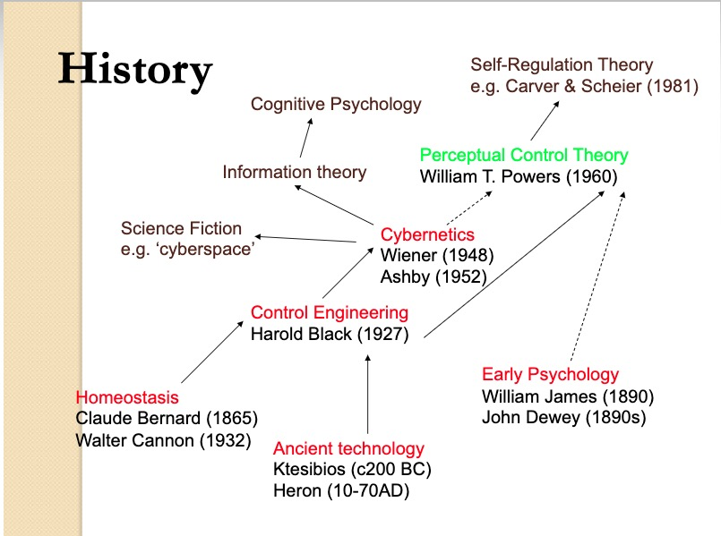

```{r setup, include=FALSE}
knitr::opts_chunk$set(echo = FALSE)
source('R/write_video_clip_html.R')

if(!require(databraryapi)){
  if(!require(devtools)){
    install.packages('devtools')
  }
  devtools::install_github('PLAY-behaviorome/databraryapi')
}
library(databraryapi)

if(!require(tidyverse)){
  install.packages('tidyverse')
}
library(tidyverse)
```


# Preliminaries

---


</br>


</br>


<!-- Funding sources with icons -->

---


</br>


<!-- Photo montage of ROG background -->

## Overview

- Psychology is the hardest science
- Four realms and their interactions
- You say you want a revolution
- We all want to change the world
- How to spend wisely & well

# Psychology is the hardest science

---


---


## But why?

---


<!-- The whole elephant -->

---

<p><a href="https://commons.wikimedia.org/wiki/File:Pieter_Bruegel_the_Elder_-_The_Tower_of_Babel_(Vienna)_-_Google_Art_Project.jpg#/media/File:Pieter_Bruegel_the_Elder_-_The_Tower_of_Babel_(Vienna)_-_Google_Art_Project.jpg"></a>
</p>

<!-- Field has become highly specialized and communication across subfields has become difficult -->

<!-- --- -->

<!--  -->

<!-- --- -->

<!-- ## The 'Rumsfeldian' space of knowledge -->

<!-- | | | -->
<!-- |------------------|------------------| -->
<!-- | known-knowns | known-unknowns | -->
<!-- | unknown-knowns | unknown-unknowns | -->

<!-- ## The 'Rumsfeldian' space of knowledge -->

<!-- | | | -->
<!-- |------------------|------------------| -->
<!-- | known-knowns | known-unknowns | -->
<!-- | **unknown-knowns** | unknown-unknowns | -->

<!-- --- -->

<!--  -->

<!-- <!-- - What does psychology aim to understand? -->

---


<!-- Definition of psychology -->

## Oh give me a 'ome...

- [Genome](https://www.genome.gov/12011238/an-overview-of-the-human-genome-project/)
- [Proteome](https://hupo.org/human-proteome-project)
- [Metabolome](http://www.hmdb.ca/)
- [Connectome](http://www.humanconnectomeproject.org/)
- Behaviorome?

---

>"*Behavior is the linchpin of the most vexing problems in public health, and a better understanding of behavior is fundamental to achieving positive health outcomes, from prenatal development throughout adulthood.*"

<small>
[Gilmore, Adolph, & Tamis-LeMonda, 2019](https://www.rick-gilmore.com/post/behavior-is-the-linchpin/)
</small>

---

>"*Behavior contributes to the progression or prevention of disease, defines a disorder or marks recovery, and provides mechanisms for therapeutic intervention.*"

<small>
[Gilmore, Adolph, & Tamis-LeMonda, 2019](https://www.rick-gilmore.com/post/behavior-is-the-linchpin/)
</small>

# 4 realms and their interactions

---


---

| Realm               | Domain               |
|---------------------|----------------------|
| $W$   | The world |
| $B$   | The body |
| $N$   | The nervous system |
| $M$   | The mind |

## Nested causality

- Mind ($M$) within nervous system ($N$)
- Nervous system ($N$) within body ($N$)
- Body ($B$) within world ($W$)

## Mutual coupling of dynamic states

$\dot{M} = f(M,N)$

$\dot{N} = f(N,B)$

$\dot{B} = f(B,N,W)$

$\dot{W} = f(W,B)$

## Measure

- $W$, $B$, $N$ **directly**
- At varied spatial & temporal scales

---

<a href="">

</a>

<small>
[Sejnowski, Churchland, & Movshon, 2014](http://doi.org/10.1038/nn.3839)
</small>

## Measure

- $M$ **indirectly**
- Only via $N$, $B$

## $M$ highly salient, but...

---


<!-- Fox on an iceberg. Like iceberg, belies bulk below. -->

---

<p><a href="https://commons.wikimedia.org/wiki/File:Blackbox3D-withGraphs.png#/media/File:Blackbox3D-withGraphs.png"></a><br>By <a href="//commons.wikimedia.org/wiki/User:Krauss" title="User:Krauss">Krauss</a> - <span class="int-own-work" lang="en">Own work</span>, <a href="https://creativecommons.org/licenses/by-sa/4.0" title="Creative Commons Attribution-Share Alike 4.0">CC BY-SA 4.0</a>, <a href="https://commons.wikimedia.org/w/index.php?curid=45608217">Link</a></p>

---

> "*How should an experimenter proceed when faced with a black box?*"

<small>
[Ashby, 1956/2015](https://www.amazon.com/Introduction-Cybernetics-W-Ross-Ashby/dp/1614277656), 6/2
</small>

---


---

> "*What properties of the Box's contents are discoverable and what are fundamentally not discoverable?*"

<small>
[Ashby, 1956/2015](https://www.amazon.com/Introduction-Cybernetics-W-Ross-Ashby/dp/1614277656), 6/2
</small>

---

> "*What methods should be used if the Box is to be investigated efficiently?*"

<small>
[Ashby, 1956/2015](https://www.amazon.com/Introduction-Cybernetics-W-Ross-Ashby/dp/1614277656), 6/2
</small>

---

> "*The primary data of any investigation of a Black Box consists of a sequence of values of the vector with two components: (input state, output state).*"

<small>
[Ashby, 1956/2015](https://www.amazon.com/Introduction-Cybernetics-W-Ross-Ashby/dp/1614277656), 6/5
</small>

---

> "*...all fundamental knowledge obtainable from a Black Box...is such as can be obtained by re-coding the protocol [sequence of input/output measurements].*"

<small>
[Ashby, 1956/2015](https://www.amazon.com/Introduction-Cybernetics-W-Ross-Ashby/dp/1614277656), 6/5
</small>

---

> "*The theory of the Black Box is simply the study of the relations between the experimenter and his environment, when special attention is given to the flow of information.*"

<small>
[Ashby, 1956/2015](https://www.amazon.com/Introduction-Cybernetics-W-Ross-Ashby/dp/1614277656), 6/18
</small>

# You say you want a revolution...

---


<small>
B.F. Skinner
</small>

## $S \rightarrow R$ psychology

- $S$ (stimulus) -> $R$ (response)
- $S$ and $R$ observable

---

```{r, echo=FALSE, message=FALSE, warning=FALSE}
library(igraph)
el <- rbind(c("W","S"), c("S","B"), c("B","R"), c("R","W"))
g0 <- graph_from_edgelist(el)
g0$layout <- layout_in_circle
plot(g0, vertex.size=50, vertex.color="gray")
```

---

- $S$ is the effect of some $W_i$ on $B$
- $R$ is some change in $B$ ($\dot{B_i}$) that is observable in $W$
    
---


<small>
Noam Chomsky
</small>

## $S \rightarrow C \rightarrow R$

- $S$ (stimulus) -> $C$ (cognition/computation) -> $R$ (response)
- $C$ inferred from structure in $S$->$R$
- $C$ elaborate, probably innate
- $S$ alone insufficient to explain $C$, especially language [(Chomsky, 1959)](http://cogprints.org/1148/1/chomsky.htm)

## The cognitive 'revolution'

- $C$ ($M$) viewed in *algorithmic* terms
- Formal operations on information structures
- Developed in parallel with computer science, AI

---

<!-- Michael Gazzaniga -->


<small>
Michael Gazzaniga
</small>

## The cognitive (neuroscience) 'revolution'

- Developed alongside cognitive science
- $C (M) \leftrightarrow N$
- What $N_i$ compute functions of $C (M)$?
- Assume 1:1 relationship between $N$ and $C (M)$

---


<!-- Fodor's Modularity of Mind -->

---


<!-- Phrenology -->

## The problem with revolutions...


<!-- "Is that something is always lost..." -->

## Linear/open-loop causal chains

- $S \rightarrow R$ 
- $S \rightarrow C \rightarrow R$

## vs. *closed-loop* causal chains

```{r, echo=FALSE, message=FALSE, warning=FALSE}
#library(igraph)
el <- rbind(c("C","R"), c("R","W"), c("W","S"), c("S","C"))
g <- graph_from_edgelist(el)
g$layout <- layout_in_circle
plot(g, vertex.size=50, vertex.color="gray")
```

---

Actions/responses ($R$) affect the World ($W$)
</br></br>
$W$ states induce sensations ($S$)
</br></br>
$S$ affect $C$ (computations/cognitions)
</br></br>
$C$ affect $A$

...

## Consequences...

- Properties of $W$ downplayed, ignored
- Why are $S$ or $C$ causal but not $R$?
- *Variability* in behavior $R$ only noise
- *Origins* of $R$, $C$, $A$?
- $W \leftrightarrow B \leftrightarrow N$ reflect ontogenetic and phylogenetic history

---

<!--  -->


## In fact, human cognition is...

---

A dynamic and multi-scale system


<https://www.jsmf.org/programs/cs/>

# Our (essential) open science future

## Is there a reproducibility crisis in science?

- Yes, a significant crisis
- Yes, a slight crisis
- No crisis
- Don't know

---

<div class="centered">

</br>
<small>
([Baker, 2016](http://doi.org/10.1038/533452a))
</small>
</div>

## Have you failed to reproduce an experiment from your lab or someone else's?

---

<div class="centered">

</br>
<small>([Baker, 2016](http://doi.org/10.1038/533452a))</small>
</div>

<div class="notes">
</div>

## Why this matters

---

>"*The advancement of detailed and diverse knowledge about the development of the world’s children is essential for improving the health and well-being of humanity…*"

---

>"*We regard scientific integrity, transparency, and openness as essential for the conduct of research and its application to practice and policy…*"

<small>
<https://www.srcd.org/about-us/policy-scientific-integrity-transparency-and-openness>
</small>

## Open science will accelerate discovery

- Open sharing of materials, analysis code, & data
- Causal/dynamic models in discoverable formats
- Video + physio + other temporally dense time series?
- [Databrary.org](https://databrary.org)

<!-- ## An openly-shared 'behaviorome' -->

<!-- --- -->

<!-- ```{r, results='asis', echo=FALSE} -->
<!-- write_video_clip_html("https://nyu.databrary.org/slot/27087/0,372193/asset/119877/download?inline=true", vid_w_pix = 640, vid_h_pix = 480, show_link = FALSE) -->
<!-- ``` -->

# Take homes

---


<!-- Nested causality -->

---

```{r, echo=FALSE, message=FALSE, warning=FALSE}
plot(g, vertex.size=50, vertex.color="gray")
```

---

| Algorithms | Dynamics |
|------------|----------|
| for x in range(0, n): | $\dot{x}=f(x,a)$  |

Different ways to characterize Black Boxes

---



<small>
[(Maunsell)](https://slideplayer.com/slide/4374326/)
</small>

<!-- History of cybernetics, how lost to cognitive science -->

---


<!-- --- -->

<!--  -->

<!-- <small> -->
<!-- [(Wang et al. 2012)](https://doi.org/10.1016/j.sysarc.2012.06.004) -->
<!-- </small> -->

<!-- Hierarchical control illustration -->

<!-- --- -->

<!-- Suggests an 'outside-in' approach to inquiry. Characterizing behaviors (or physiological states) where the perceptual control dynamics are well-enough known. -->
<!-- Embrace multisensory flows. -->
<!-- If we understand these dynamics sufficiently well, they will illuminate the $M$/$N$. Quote from Turvey & Shaw? -->

---

<div class="centered">

</br>
<small>
[Swanson, 2005](http://dx.doi.org/10.1002/cne.20733)
</small>
</div>

<!-- ## Complicate before simplifying? -->

<!-- --- -->

<!--  -->

# How to spend wisely & well

## Support research that

- studies behavior (& internal states)
- samples densely (and/or broadly) in time & space
- creates meaningful linkages across levels of analysis
- connects between & among systems

---

- exploits knowledge about nested feedback loops
- moves beyond qualitative micro-theories
- provides specifics about theorized algorithms or dynamics

---

- shares procedures, materials, code, & data openly

---


<!-- The whole elephant -->

---

<div class="centered">


<!-- Girl hugging elephant -->

# Thank you

---

<video width="800" data-autoplay>
  <source src="https://github.com/gilmore-lab/DEVSEC-2018/blob/master/mov/databrary-splash.mp4?raw=true" type="video/mp4">
  </video>
<small>
rogilmore@psu.edu</br>
<https://gilmore-lab.github.io></br>
<https://gilmore-lab.github.io/2019-03-25-cne/></br>
[\@rogilmore](https://twitter.com/rogilmore)
</small>

# Materials

---

This talk was produced on `r Sys.Date()` in [RStudio](http://rstudio.com) version using R Markdown and the reveal.JS framework.
The code and materials used to generate the slides may be found at <https://github.com/gilmore-lab/2019-06-03-McDonnell-Fdn/>.
Information about the R Session that produced the code is as follows:

---

```{r session-info}
sessionInfo()
```
