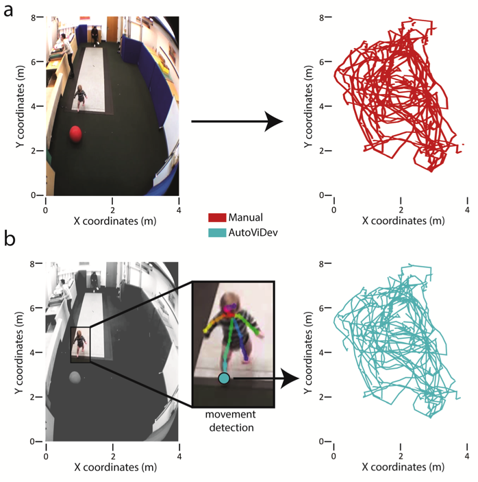

```{r setup, include=FALSE}
knitr::opts_chunk$set(echo = FALSE, cache=TRUE)
source('R/write_video_clip_html.R')

if(!require(databraryapi)){
  if(!require(devtools)){
    install.packages('devtools')
  }
  devtools::install_github('PLAY-behaviorome/databraryapi')
}
library(databraryapi)

if(!require(tidyverse)){
  install.packages('tidyverse')
}
library(tidyverse)

if(!require(igraph)){
   install.packages('igraph')
}
library(igraph)

# Log-in to Databrary
logged_in <- databraryapi::login_db(params$db_id)
```

# Preliminaries

---


</br>


</br>


<!-- Funding sources with icons -->

<div class="notes">
I want to thank NSF, NIH, the Alfred P. Sloan Foundation, SRCD, the LEGO Foundation, and the James S. McDonnell Foundation for support.
</div>

---


</br>


<!-- Photo montage of ROG background -->

<!-- As brief background, I grew up in Denver, studied cognitive science at Brown, worked in non-profit management in DC before completing my Ph.D. in developmental cognitive neuroscience at Carnegie Mellon. -->
<!-- That's where I met Karen Adolph. -->
<!-- I moved to Penn State after finishing my degree. -->
<!-- I'm an infrastructure guy. -->
<!-- I founded Penn State's imaging center, and I am the co-founder and co-director of Databrary. -->

<div class="notes">
This is a brief bio in photos. As brief background, I grew up in Denver, studied cognitive science at Brown, worked in non-profit management in DC before completing my Ph.D. in developmental cognitive neuroscience at Carnegie Mellon. That's where I met Karen Adolph. I moved to Penn State after finishing my degree. In addition to building my own line of work in visual development and neuroscience, I founded Penn State's imaging center, and I am the co-founder and co-director of Databrary.
</div>

## Overview

- The hardest science
- Why it's hard
- Making cognitive science even better

<!-- Today I'm delighted to have the opportunity to share a few thoughts about how understanding how and why the science of human behavior is so hard will help research sponsors like JSMF accelerate progress. -->

<div class="notes">
Today I'm delighted to have the opportunity to share a few thoughts with you about why the science of human thought and behavior is so challenging and how reflecting on its challenges can make the science better.
[RIGHT]
</div>

# Psychology is the hardest science

<div class="notes">
I claim that psychology is the hardest science.
</div>

## (Harder than physics)

<div class="notes">
Harder than physics.
I suspect most of the people in this room agree, but in case there are skeptics, let me try to convince you in two simple figures.
</div>

---


<!-- First year physical science students often face problems like this. Given a mass M, an inclined plane with specified geometry, and a gravitational field, we can predict the future with high precision. What's going to happen next? -->

<!-- Yes, but if we change one element in this equation, the problem becomes immensely harder. What if we change the mass to a mouse? -->

<div class="notes">
First year physical science students often face problems like this. Given a mass M, an inclined plane with specified geometry, and a gravitational field, we can predict the future with high precision. What's going to happen next?

Yes, but if we change one element in this equation, the problem becomes immensely harder. What if we change the mass to a mouse?
</div>

---


<!-- What happens now? We don't know. -->

<div class="notes">
What happens now? 
We don't have a clue!
Even asking the question seems humorous.

[RIGHT]

Let's examine why it's so hard.
</div>

# Why it's hard

<!-- My message today is that understanding why psychology and related sciences are so hard can be useful in making these allied fields better. -->

---


<!-- The whole elephant -->

<div class="notes">
This figure depicts the classic Hindu myth of the blind men examining an elephant. 
To me, it also reflects the state of psychological science.

We're all studying the elephant, or so we say, but we might easily mistake the trunk for a spear, or the tail for a rope, and so forth.

I want to see the whole elephant!
Don't you?
</div>

---

<p><a href="https://commons.wikimedia.org/wiki/File:Pieter_Bruegel_the_Elder_-_The_Tower_of_Babel_(Vienna)_-_Google_Art_Project.jpg#/media/File:Pieter_Bruegel_the_Elder_-_The_Tower_of_Babel_(Vienna)_-_Google_Art_Project.jpg"></a>
</p>

<!-- And like the builders of the Tower of Babel after suffering God's wrath, we often struggle to communicate with one another about essential ideas. -->

<div class="notes">
This painting of the Tower of Babel should remind all of us often we're  like the builders after suffering God's wrath: Too often we struggle to communicate with one another about essential concepts and ideas from our distinct subfields.

For example, William James may have said that 'everyone knows what attention is', but I'm not sure we agree.
</div>

---


<!-- Perhaps less widely appreciated, the phenomena we study have a nested structure. -->

<div class="notes">
Relatedly, but perhaps less widely appreciated, the phenomena we study have a complex nested structure.

I designed this logo for my lab group to remind me of it.

The science of the mind and behavior collects and integrates evidence from at least four logically separable but mutually embedded realms.
</div>

---

- Body ($B$) within world ($W$)
- Nervous system ($N$) within body ($B$)
- Mind ($M$) within nervous system ($N$)

<div class="notes">

Our bodies are embedded in a world.
Our nervous systems with our bodies.
And our mind within the nervous system.
</div>

---

$\dot{M} = f(M,N)$

$\dot{N} = f(N,B)$

$\dot{B} = f(B,N,W)$

$\dot{W} = f(W,B)$

<div class="notes">
And using the mathematical language of dynamical systems, we can say that these realms are mutually coupled to one another: Changes in the mind are a function of mental and nervous system states, and so forth...

And make no mistake: The mind, brain, and body are non-linear dynamical systems, whether or not we study them that way.

Dynamical systems involve rule-based changes in state variables.
</div>

## Measure

<!-- The good news is that we have tools for measuring... -->

<div class="notes">
We have a growing box of tools for measuring many of them.
</div>

---

- $W$, $B$, $N$ more or less **directly**

<!-- States of the world, the body, and the nervous system more or less directly, across the multiple spatial and temporal scales of the relevant phenomena. -->

<div class="notes">
States of the world, the body, and the nervous system can be measured more or less directly...
</div>

---

<a href="">

</a>

<small>
[Sejnowski, Churchland, & Movshon, 2014](http://doi.org/10.1038/nn.3839)
</small>

<div class="notes">
...across multiple spatial & temporal scales.
This figure from Sejnowski et al. shows how the neuroscientist's toolkit has expanded substantially over the last several decades.

I believe that JSMF support has contributed to this growth.
</div>

---

- Measure mental states $M$ **indirectly**
- Via $N$, $B$, $W$ (+ prior beliefs/knowledge)

<!-- But unfortunately, while often the star of the psychological show, we can only measure mental states indirectly via the nervous system, or changes in body state or behavior, and informed by prior beliefs and knowledge about those states. -->

<div class="notes">
But unfortunately, while often the star of the psychological show, we can only measure mental states indirectly via the nervous system, or changes in body state or behavior, and informed by prior beliefs and knowledge about those states.

I think these differences in measurement have consequences for inference we have yet to confront fully.

Beyond challenges in measurement, we may not appreciate the structure of the theoretical frameworks that dominate our scientific discourse.

I've recently become interested in some of the intellectual ancestors to cognitive science that we seem to have abandoned along the way: cybernetics and control theory are among them.
</div>

## Linear/open-loop theoretical frameworks dominate 

<!-- We have a long and rich intellectual history that rests on a linear/open loop conceptualization. -->

<div class="notes">
In the language of these fields, linear/open-loop theoretical frameworks dominate psychological science.
</div>
---


B.F. Skinner

<div class="notes">
Consider the S-R psychology of the behaviorists, best epitomized by B.F. Skinner.
</div>

---

$Stimulus (S) \rightarrow Response (R)$

```{r, echo=FALSE, message=FALSE, warning=FALSE}
el1 <- rbind(c("S","R"))
g1 <- igraph::graph_from_edgelist(el1)
g1$layout <- igraph::layout_in_circle
plot(g1, vertex.size=50, vertex.color="gray", edge.color = "blue")
```

<div class="notes">
Behaviorism attempted to show how all observable behavior could be determined by understanding the links between stimuli and responses.
</div>

---


Noam Chomsky

<div class="notes">
Or the cognitive critique of behaviorism articulated most effectively by Noam Chomsky.
</div>

---

$Stimulus (S) \rightarrow Cognition (C) \rightarrow Response (R)$

```{r, echo=FALSE, message=FALSE, warning=FALSE}
el2 <- rbind(c("S","C"), c("C", "R"))
g2 <- igraph::graph_from_edgelist(el2)
g2$layout <- igraph::layout_in_circle
plot(g2, vertex.size=80, vertex.color="gray", edge.color = "blue")
```

<div class="notes">
Here significant, essential processing (cognition or computation) intervene between stimulus and response.
</div>

---

<!-- Michael Gazzaniga -->


<div class="notes">
Or the marriage of neuroscience with cognitive science advanced by Michael Gazzaniga...
</div>

---

$S \rightarrow N \leftrightarrow C \rightarrow R$

```{r, echo=FALSE, message=FALSE, warning=FALSE}
el2 <- rbind(c("S","C"), c("N", "C"), c("C", "N"), c("C", "R"))
g2 <- igraph::graph_from_edgelist(el2)
g2$layout <- igraph::layout_in_circle
plot(g2, vertex.size=80, vertex.color="gray", edge.color = "blue")
```

<div class="notes">
that brings to bear evidence about the computing hardware to understanding the operation of the mind's software.

Make no mistake, I view this progression of ideas as advancing our understanding of the mind and brain.
</div>

## *Closed-loop* causal chains better reflect the underlying reality

<!-- When in fact, closed-loop causal chains better reflect the underlying reality of the embedded and coupled systems we care about understanding. -->

<div class="notes">
But I also think that the underlying reality is more complex than this, and that non-linear, closed-loop, causal chains better reflect what cognitive science is really about.
</div>

---

```{r, echo=FALSE, message=FALSE, warning=FALSE}
el <- rbind(c("C","R"), c("R","W"), c("W","S"), c("S","C"))
g <- igraph::graph_from_edgelist(el)
g$layout <- igraph::layout_in_circle
plot(g, vertex.size=80, vertex.color="gray", edge.color = "blue")
```


<div class="notes">
The reality is that responses affect the world, responses and world states evoke stimuli, stimuli affects cognition, cognition affects responses, and the cycle repeats.

Non-linear, closed-loop dynamical systems like this require broader and denser data about all of the realms in order to reveal the underlying processes.
Data that can be difficult or expensive to collect.

But even in situations when the data are available, when all of these states are well-known, our current methods have some striking limitations.
</div>

---


<small>
[Jonas & Kording 2017](https://doi.org/10.1371/journal.pcbi.1005268)
</small>

<!-- Jonas and Kording used conventional neuroscience techniques to simulate 'recording' from a microprocessor that was engaged in the inputs and outputs of a well-known video game. -->

<div class="notes">
A recent paper by Jonas and Kording illustrates this point.
These authors used conventional neuroscience techniques -- studying the connection pattern, observing the effects of damage on performance, responses of individual components to simulate 'recording' from a microprocessor that was engaged in the inputs and outputs of several well-known video games.
So, in effect, they already 'knew' the answers they were looking for.

What did they find?
</div>

---

>"*We show that [classic analytic neuroscience] approaches reveal interesting structure in the data...*"

<small>
[Jonas & Kording 2017](https://doi.org/10.1371/journal.pcbi.1005268)
</small>

---

>"*...but do not meaningfully describe the hierarchy of information processing in the microprocessor.*" 

<small>
[Jonas & Kording 2017](https://doi.org/10.1371/journal.pcbi.1005268)
</small>

---

>"*This suggests current analytic approaches in neuroscience may fall short of producing meaningful understanding of neural systems, regardless of the amount of data.*"

<small>
[Jonas & Kording 2017](https://doi.org/10.1371/journal.pcbi.1005268)
</small>

<!-- So, while there are many questions in cognitive science and neuroscience where more data are essential, bigger data aren't enough. -->

<!-- Moreover, there are reasons to think we may need to broaden our approach. -->

<div class="notes">
So, while there are many questions in cognitive science and neuroscience where more data are essential, bigger data aren't enough.

Moreover, there are reasons to think we may need to broaden our approach to information processing.
</div>

---

<iframe src="https://www.theatlantic.com/technology/archive/2015/09/not-even-the-people-who-write-algorithms-really-know-how-they-work/406099/" height=600 width=1000>
</iframe>

<div class="notes">
The Turing machine as a universal computational device is the dominant framework in computer science, and most cognitive scientists think (explicitly or not) that the mind is some sort of computational device.

Central to this way of thinking is the goal of cognitive science is to reveal the algorithms or recipe for evaluating and transforming data.

We don't have to look very far to see how powerful and widespread algorithms have become in our day-to-day life.
</div>

---

<p><a href="https://commons.wikimedia.org/wiki/File:Maquina_vapor_Watt_ETSIIM.jpg#/media/File:Maquina_vapor_Watt_ETSIIM.jpg"></a>

<small>
<br>By Nicolás Pérez, <a href="http://creativecommons.org/licenses/by-sa/3.0/" title="Creative Commons Attribution-Share Alike 3.0">CC BY-SA 3.0</a>, <a href="https://commons.wikimedia.org/w/index.php?curid=195711">Link</a></p>
</small>

<div class="notes">
But algorithms aren't the only useful ways to transform information.

This is the steam engine designed by James Watt in the late 1700s.
It helped launch the industrial age.
</div>

---

- How to regulate the speed of a Watt-style steam engine?

<div class="notes">
And like most powerful and useful machines, it has to be controlled to be useful.
Beyond turning it on and off, the most important control is speed.
How to keep the speed constant?
</div>

---

```
1. Measure the speed of the flywheel.
2. Compare the actual speed against the desired speed.
3. If there is no discrepancy, return to step 1. Otherwise,
    a. measure the current steam pressure;
    b. calculate the desired alteration in steam pressure;
    c. calculate the necessary throttle valve adjustment.
4. Make the throttle valve adjustment.
5. Return to step 1. 
```

<div class="notes">
To a 21st century audience steeped in algorithmic thinking and surrounded by computational devices, the answer is obvious: Measure the speed, compare it to some desired value, if it differs, adjust the steam valve up or downward.

This is a negative feedback loop of the sort we're familiar with in various contexts, from thermostats to cruise control in our cars.

Note that the algorithm presumes that there are variables we can measure -- like speed, and calculations we can quickly and accurately.
</div>

---

<p><a href="https://commons.wikimedia.org/wiki/File:Centrifugal_governor.png#/media/File:Centrifugal_governor.png"></a></p>

<!-- The real world solution Watt devised was a mechanical one. It took advantage of the interactions of mechanical elements, rotational and gravitational forces. -->

<div class="notes">
The real world solution Watt devised was mechanical and of a completely different form.
Cheap sensors hadn't been invented yet.
All calculation was done by humans, not machines.
Watt's solution took advantage of the interactions of mechanical elements, rotational and gravitational forces.
</div>

## Algorithms vs. Dynamics ([Van Gelder, 1995](http://dx.doi.org/10.2307/2941061))

<!-- I give credit to Tim Van Gelder for pointing out that a strictly information processing/computational approach pushes us to seek out algorithms when systems that exploit intrinsic dynamics of the materials might more useful. -->

<div class="notes">
I thank Tim Van Gelder for persuasively arguing that a strictly information processing/computational approach pushes us to seek out algorithms when systems that exploit intrinsic dynamics of the materials might more useful or appropriate.
</div>

---

- "If all you have is a hammer, everything looks like a nail." (Maslow)
- How much do we *really* understand about biological computing? 

<div class="notes">
The implication is that we may see computational devices everywhere because they are ubiquitous in the environments we have created.

But does this necessarily mean that biological entities work this way or in all cases?
How much do we really understand about how biological entities compute?
</div>

## *Biological* computing

---

- Constrained by space, time, energy

---


25 W vs. ?? MW

<!-- Alpha Go vs. Ke Jie -->

<div class="notes">
This photo shows Google's AI system, AlphaGo in the midst of defeating the World Champion Go player.
Considering that Go was thought far too difficult a game for computers to master, it's indeed an achievement.

But the human player's brain was using about 25 W. 
I don't know that Google has revealed AlphaGo's power consumption in doing the same task, but it was probably in the megawatts.

So we're a long way from developing computational systems that are as energy efficient as brains.
</div>

---

<!-- Biological computing... -->

- Computes with chemistry (neurotransmitters, hormones) when possible
- With 'wires' (axons & dendrites) when necessary

<div class="notes">
One reason for this may be that biological computing seems to involve chemistry whenever possible, and wires only when necessary.
</div>

---


<div class="notes">
Peter Sterling and Simon Laughlin discuss the implications of this in their book Neural Computing.

I think it's safe to say that we don't yet appreciate the implications of this sort of hybrid computing architecture.
</div>

<!-- Sterling and Laughlin -->

## *Biological* computing

<div class="notes">
There are other important facets of biological computing.
</div>

---

- Engages in real-time behaviors with existential consequences (e.g., ingestion, defense, reproduction, locomotion, pursuit)
- Operates effectively in complex, dynamic environments
- Operates in single cells to aggregates of quadrillions...

<div class="notes">
It [READ slide]
</div>

---

<iframe width="800" height="600" src="https://www.youtube.com/embed/9nxoSRasq2Q" frameborder="0" allow="accelerometer; data-autoplay; encrypted-media; gyroscope; picture-in-picture" allowfullscreen></iframe>

<div class="notes">
This video shows a species of algae, *Euglena*, locomoting through the environment with the help of a whip-like flagellum.

If we count sensation, locomotion, decision-making, adaptation as part of the cognitive apparatus, then even single celled organisms seem to carry out these operations in some form.
</div>

<!-- Video of Euglena in locomotion -->

<!-- to live is to move, sense, compute, adapt... -->

<!-- ## Biological computing -->

<!-- --- -->

<!-- - Separates neural 'streams' for $S \leftrightarrow C \leftrightarrow A$ -->

<!-- --- -->

<!-- <div class="centered"> -->
<!--  -->

<!-- <small> -->
<!-- [Swanson 2005](http://dx.doi.org/10.1002/cne.20733) -->
<!-- </small> -->
<!-- </div> -->

<!-- ## Bigger, denser, more diverse data will help, but -->

<!-- ## Big data (-omics) initiatives in the biological sciences... -->

<!-- --- -->

<!-- - [Genome](https://www.genome.gov/12011238/an-overview-of-the-human-genome-project/) -->
<!-- - [Proteome](https://hupo.org/human-proteome-project) -->
<!-- - [Metabolome](http://www.hmdb.ca/) -->
<!-- - [Connectome](http://www.humanconnectomeproject.org/) -->

## To live is to move, sense, compute, adapt...

<div class="notes">
Indeed, we can rightly say that moving, sensing, computing, adapting are fundamental properties of life.

Now, I'm not suggesting that biological computing in single-celled organisms is identical to that of multicellular organisms or that these processes should be called 'cognition'.
But I am saying that we might gain some insight into human cognition by asking what parts of this elephant we're ignoring.
</div>

## Big data (-omics) approaches to other questions in biomedicine largely overlook *behavior*

<div class="notes">
For example, other areas of biomedicine have taken 'big data' approaches to revealing the structure at different levels of spatial and temporal resoulution.

Of course I refer to the genome, proteome, metabolome, and connectome projects.

Curiously, these approaches largely overlook one of the principal outputs of all of this machinery: *behavior*.
</div>

---

<a href="https://doi.org/10.1016/j.neuron.2016.12.041">

</a>

<!-- Krakauer paper title -->

<div class="notes">
The oversight is slowly gaining recognition in neuroscience, as indicated by this recent paper by Krakauer and colleagues.
</div>

---

<div class="centered">


<small>
[Krakauer et al. 2017](https://doi.org/10.1016/j.neuron.2016.12.041)
</small>
</div>

<div class="notes">
Krakauer and colleagues question whether the behaviors we study are truly representative, whether there is a one-to-one relationship between brain systems and those behaviors, and so on.
</div>

---

>"*Behavior is the linchpin of the most vexing problems in public health...*"

<small>
[Gilmore, Adolph, & Tamis-LeMonda, 2019](https://www.rick-gilmore.com/post/behavior-is-the-linchpin/)
</small>

<div class="notes">
My colleagues and I have argued that behavior is the linchpin of the most vexing problems in public health.
</div>

---

>"*Behavior contributes to the progression or prevention of disease, defines a disorder or marks recovery, and provides mechanisms for therapeutic intervention.*"

<small>
[Gilmore, Adolph, & Tamis-LeMonda, 2019](https://www.rick-gilmore.com/post/behavior-is-the-linchpin/)
</small>

<div class="notes">
That behavior contributes to the progression or prevention of disease, defines a disorder or marks recovery, and provides mechanisms for therapeutic intervention.
</div>

---

>"*...a better understanding of behavior is fundamental to achieving positive health outcomes, from prenatal development throughout adulthood.*"

<small>
[Gilmore, Adolph, & Tamis-LeMonda, 2019](https://www.rick-gilmore.com/post/behavior-is-the-linchpin/)
</small>

<div class="notes">
And that a better understanding of behavior is fundamental to achieving positive health outcomes, from prenatal development throughout adulthood.

I'd extend these claims to the principal task of understanding human cognition.
</div>

---


<div class="notes">
So psychology and allied fields are harder than physics for many reasons.

But there is an additional challenge that all sciences face: The challenge of producing reliable, robust, generalizable findings.

Richard Harris' book, Rigor Mortis, exposes some shocking problems with reproducibility in biomedical research, and I urge you to read it.
</div>

## Is there a reproducibility crisis in science?

<div class="notes">
But let's start with a question: Is there a reproducibility crisis in science?

Nature asked scientists across fields this question in 2016.

Let's focus on psychological science.
</div>

---

- Yes, a significant crisis
- Yes, a slight crisis
- No crisis
- Don't know

<div class="notes">
So, how many of you think there is a significant crisis in psychological science? A slight crisis? No crisis? Don't know.
</div>

---

<div class="centered">

</br>
<small>
[Baker, 2016](http://doi.org/10.1038/533452a)
</small>
</div>

<div class="notes">
These are the results.
</div>

## Have you failed to reproduce an experiment from your lab or someone else's?

<div class="notes">
Nature asked a second question you can think about yourself.

I think the results are especially interesting.
</div>

---

<div class="centered">

</br>
<small>
[Baker, 2016](http://doi.org/10.1038/533452a)
</small>
</div>

<div class="notes">
Look at the fields where the highest levels of failures to replicate are reported: chemistry, biology, physics & engineering, earth and mineral sciences.
The so-called 'hard' sciences.

I'm not sure, but I think psychology and the social sciences fall into 'other'.
See, we're not doing so badly!
</div>

---

<div class="centered">
<a href="http://www.nature.com/polopoly_fs/7.36719.1464174488!/image/reproducibility-graphic-online4.jpg_gen/derivatives/landscape_630/reproducibility-graphic-online4.jpg">

</a>

<small>[Baker 2016](http://doi.org/10.1038/533452a)</small>
</div>

<!-- Factors contributing to irreproducible research -->

<div class="notes">
We won't dwell on the factors that respondents said contribute to these problems, but I think they are by now familiar.
</div> 

---

<div class="centered">
<a href="http://www.nature.com/articles/s41562-016-0021/figures/1">

</a>

<small>[Munafo et al. 2017](http://doi.org/10.1038/s41562-016-0021)</small>
</div>

<div class="notes">
And I'm greatly encouraged by the attention and energy psychologists are giving to how to improve research methodology and inference.
</div>

---


<div class="notes">
One area where I think we could spend a bit more energy concerns the role of theory, and for this, I thank George Mischel for giving the problem a clever name: the toothbrush problem.
</div>

---

> "*...psychologists tend to treat other peoples’ theories like toothbrushes; no self-respecting individual wants to use anyone else’s.*"

<small>[Mischel, 2009](https://www.psychologicalscience.org/observer/becoming-a-cumulative-science)</small>

---

> "*The toothbrush culture undermines the building of a genuinely cumulative science, encouraging more parallel play and solo game playing, rather than building on each other’s directly relevant best work.*"

<small>[Mischel, 2009](https://www.psychologicalscience.org/observer/becoming-a-cumulative-science)</small>

<div class="notes">
Do we want to build a 'genuinely cumulative science'?

I do, and I think you do, too.

So what do we need to do?

[RIGHT]
</div>

# Making cognitive science even better

## Support research that

<div class="notes">
I suggest that sponsors like JSMF should support research that...
</div>

---

- studies *behavior(s)*
- not just (difficult-to-measure-directly) internal states

---


<small>[Powers 1973](https://www.amazon.com/Behavior-Perception-William-T-Powers/dp/0964712172)
</small>

<div class="notes">
Bill Powers work on perceptual control theory seems to have left little mark on psychology, but this figure from his 1973 book I find instructive.

It shows how one might decompose a simple object tracking task into a series of perception/computation/action loops.

We could and should have rich descriptions of and theories about behaviors.
</div>

---

- samples densely (and/or broadly) in time & space
- creates meaningful linkages across levels of analysis

<div class="notes">
I also recommend that sponsors support research that samples densely or broadly in time & space and strives to achieve meaningful linkages across levels of analysis.
</div>

---

<div class="centered">

</div>

<div class="notes">
As this figure from Bronfenbrenner depicts, psychologists, especially those with training in development have long understood that a satisfying understanding of human behavior requires understanding influences within the individual and outside her.
</div>

---

<div class="centered">

</div>

<div class="notes">
In neuroscience, the tools of network theory have come to play important roles in inference.

And network theory is a tool that will help cognitive scientists characterize the networks of factors that influence human computation.
</div>

---

- "Responses" include behaviors
- AND autonomic/endocrine activity
- AND...

<div class="notes">
I also suggest that the range of behaviors or responses studied be broadened to include not only changes in or the active maintenance of body configurations but also heart rate, respiration, and other autonomic 'behaviors' and endocrine/hormonal activity.
</div>

---


<!-- Bart Simpson homeostasis -->

<div class="notes">
This Simpson's cartoon depicts the classic model system for studying homeostasis, temperature regulation.
</div>

---


<!-- Multiple loops for thermoregulation -->

<div class="notes">
Thermoregulation is a useful system for depicting negative feedback systems and multiple perceptual/action systems.

But it's likely that many other behavioral systems can be understood in similar terms.
Indeed, one insight from control theory and cybernetics is that if some variable is stable across time or space, it's subject to some form of control.
</div>

## Support research that

<div class="notes">
I suggest that we augment support for research that...
</div>

---

- attempts to close causal loops
- via specific algorithms and/or dynamical processes

---

- informed by rich theories of task performance (inputs, controlled variables, outputs)
- resists "premature simplification"

<div class="notes">
What's premature simplification?
</div>

---


<small>
[Matejka & Fitzmaurice](https://www.autodeskresearch.com/publications/samestats)
</small>

<div class="notes">
These data (the Datasaurus dozen) are a version of Anscome's Quartet known to statistics for a long time. All of the distributions have the same means in X and Y, the same standard deviations, and the same correlations.
If we didn't visualize the data, and took as a given the simplification provided by the summary statistics, we'd miss important details.

Dimension reduction or simplification is essential in science, but only when it adds to our understanding and doesn't discard something essential.

The challenge is knowing when it's safe to simplify and when it's not.
</div>

---


<small>[Powers 1973](https://www.amazon.com/Behavior-Perception-William-T-Powers/dp/0964712172)
</small>

<div class="notes">
This figure from Bill Powers again shows a later, more complex version of the same visual object tracking task.
Here the more complicated model explains more aspects of behavior.

I suggest that cognitive science can and should probably complicate before we simplify.
</div>

---

- demonstrates a meaningful commitment to producing rigorous, reproducible, & robust findings

<div class="notes">
I also recommend providing support for research that demonstrates a meaningful commitment to producing rigorous, reproducible, & robust findings.

That is, findings we can bank on.
</div>

---


<div class="notes">
This recent book by Deborah Mayo argues that whatever statistical framework we adopt, the common goal ought to be to rigorously test scientific claims with only the strongest surviving the tests.
</div>

## Support research that

<div class="notes">
In that spirit, I recommend that sponsors support research...
</div>

---

- collects & shares video as data & documentation

<div class="notes">
that collects and shares video as data and documentation.
</div>

## Why video?

<div class="notes">
Why single-out video?
</div>

---

<iframe src="https://www.apa.org/science/about/psa/2017/10/video-data" height=600px width=800px>
</iframe>

<div class="notes">
For starters, my colleagues and I have argued that the more widespread use of video for both purposes will improve psychological science.
</div>

## Video...

- Captures (& preserves) behavior
- Shows (& helps tell...)
- Expands the scope of inquiry
- Provides unequaled opportunities for reuse

---

<video height="600" data-autoplay>
  <source src="https://nyu.databrary.org/slot/27087/0,79000/asset/119877/download?inline=true" type="video/mp4">
Your browser does not support the video tag.
</video>

<div class="notes">
We're putting these claims to a very public test through the Play & Learning Across a Year (PLAY) project.

PLAY is collecting video recordings of mothers and infants engaged in natural activity in the home.

Human observers will add time-locked annotations of speech, language, and gesture, locomotion and physical activity, object interaction, and emotion.
</div>

---

$n=900$ 12-, 18-, 24-mo-olds; $n=30$ sites
</br></br>
demographics, health, vocabulary, media use, & temperament
</br></br>
openly shared with the research community
</br></br>
[play-project.org](https://www.play-project.org)

<div class="notes">
The coded videos plus parent-report information will be openly shared with the research community via Databrary.
</div>

---

## Support research that

- Shares procedures, materials, code, & data openly (but securely)

<div class="notes">
To build on the substantial progress psychological science is making in terms of reproducibility, I recommend supporting research that shares procedures, materials, code, & data openly (but securely).
</div>

---

<iframe src="https://play-behaviorome.github.io/PLAY-project.org/" height=600 width=800>
</iframe>

<div class="notes">
For PLAY, that means a completely open protocol, including coding definitions, item-level survey information, and so on.
</div>

---

- Makes sharing scripted, fully reproducible workflows easy

<div class="notes">
Sponsors should also support research that makes it easy for others to validate findings by creating scripted, fully reproducible workflows.
</div>

---

<iframe src="https://doi.org/10.17910/B7CC74" height=600 width=800>
</iframe>

<small>
[Tamis-LeMonda 2014](https://doi.org/10.17910/B7CC74)
</small>

<div class="notes">
Here's an example, let's say you want to explore building upon Catherine Tamis-LeMonda's shared dataset.
It's one of the largest and most diverse.
</div>

---

```
vol_8 <- databraryapi::download_session_csv(vol_id = 8)
vol_8 %>%
  filter(participant.gender %in% c('Male', 'Female')) %>%
  ggplot() +
  aes(x = participant.race, fill = participant.race) +
  facet_grid(. ~ participant.gender) +
  geom_bar(stat="count") +
  theme(axis.text.x = element_text(angle = 90, hjust = 1))
```

<div class="notes">
This small fragment of code from the R programming language downloads demographic data from Cathie's dataset and produces this summary plot.
</div>

---

```{r, include=TRUE}
vol_8 <- databraryapi::download_session_csv(vol_id = 8)
vol_8 %>%
  filter(participant.gender %in% c('Male', 'Female')) %>%
  ggplot() +
  aes(x = participant.race, fill = participant.race) +
  facet_grid(. ~ participant.gender) +
  geom_bar(stat="count") +
  theme(axis.text.x = element_text(angle = 90, hjust = 1))
```

<div class="notes">
The same code will work on another person's computer because the data come from Databrary, not from `C:\my-research-data\cathie-project`
</div>

---

R package </br>
<https://github.com/PLAY-behaviorome/databraryapi>

Python package
<https://github.com/PLAY-behaviorome/databrarypi>

<div class="notes">
These fully reproducible workflows are made possible by packages in R and Python we are developing that interact securely with the Databrary system.

They even let you excerpt segments of video or audio.
</div>

## Support research that

<div class="notes">
Finally, I recommend that sponsors support research that
</div>

---

- enables linkages between & across data sets
- exploits advances in AI and machine learning

---

<video height="600" data-controls data-autoplay>
  <source src="mov/ossmy-openpose.mp4" type="video/mp4">
Your browser does not support the video tag.
</video>

<small>Source: Ori Ossmy, NYU</small>

<div class="notes">
The video shows the output of an open source computer vision algorithm called OpenPose run on a video of a child playing in a laboratory setting. These tools promise to accelerate the annotation of video.

Linda Smith and Chen Yu have been pursuing similar efforts in their own work.
</div>

---



<small>
[Ossmy, Gilmore, & Adolph 2019](https://doi.org/10.1007/978-3-030-17798-0_14)
</small>

<div class="notes">
In our work with Ori Ossmy, we've shown that computer vision techniques can be 100 times faster than human coders and with similar levels of precision.

The human cost of video annotation is one of the biggest barriers to its widespread use, and so the potential to reduce these substantially is tremedously exciting.
</div>

## If we do these things...

<div class="notes">
In summary, if we do these things...
</div>

---


<!-- The whole elephant -->

<div class="notes">
I'm confident that we will move from holding only a tiny bit of the elephant...
</div>

---

<div class="centered">


<!-- Girl hugging elephant -->

<div class="notes">
To embracing the full beautiful beast.
</div>

# Thank you

---

<video width="800" data-autoplay>
  <source src="https://github.com/gilmore-lab/DEVSEC-2018/blob/master/mov/databrary-splash.mp4?raw=true" type="video/mp4">
  </video>
<small>
rogilmore@psu.edu</br>
<https://gilmore-lab.github.io></br>
<https://gilmore-lab.github.io/2019-06-03-McDonnell-Fdn/></br>
[\@rogilmore](https://twitter.com/rogilmore)
</small>

# Materials

---

<small>
This talk was produced on `r Sys.Date()` in [RStudio](http://rstudio.com) version using R Markdown and the reveal.JS framework.
The code and materials used to generate the slides may be found at <https://github.com/gilmore-lab/2019-06-03-McDonnell-Fdn/>.
Information about the R Session that produced the code is as follows:

---

```{r session-info}
sessionInfo()
```

```{r include=FALSE}
# if (logged_in){
#   databraryapi::logout_db()  
# }
```

</small>
